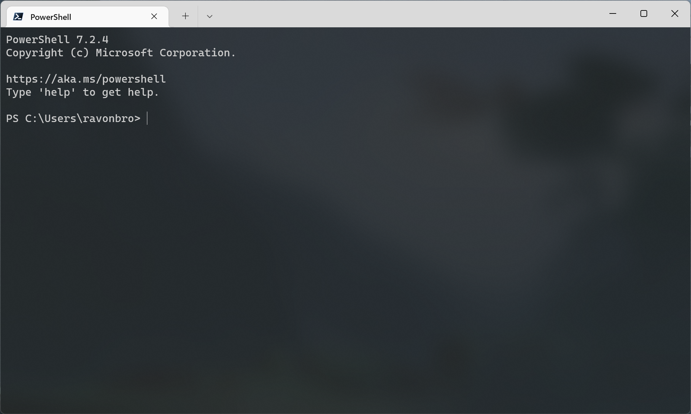

> L01-01

# Create Azure resources

To support the Contoso HR application we will deploy the following Azure resources.

| Resource | Description |
| -- | -- |
| Resource Group | Container for Azure resources |
| Managed HSM | Hardware Security Module to store encryption keys |
| Managed Identity | Identity Azure SQL will use to access the Managed HSM |
| Azure Attestation Service | Validate the integrity of Azure SQL for Always Encrypted |
| Azure SQL Logical Server | Server to host the SQL database |
| Azure SQL Database | Database to store the encrypted HR data |
| Confidential Ledger | Immutable ledger to store the sensitive HR application logs |
| Confidential Virtual Machine | Web server to host the HR application |

## Step 1 - Login to Azure

Launch **Windows Terminal** and open a PowerShell tab:



> 🔥 Make sure you change to the root folder of the Confidential Computing lab on your PC.

```Powershell
# For example mine is located here
cd c:\users\ravonbro\source\work\cel-confidential-computing
```
### 1.1 Login Azure CLI

We need to login the Azure CLI before we can use it to manage our Azure subscription.

```powershell
az login
```

Set the subscription we want Azure CLI commands to target:

```powershell
# Set your CEL individual Azure subscription (**youralias**-ag-ge-cel)
az account set --subscription <your subscription name or id here>
```

If you need a reminder of your subscription details you can list all your subscriptions:

```powershell
az account list -o table
```

### 1.2 Login Azure PowerShell

Since we are using preview services we also need to login using Azure PowerShell. We need to use it for some steps where the Azure CLI is not working yet.

```Powershell
Login-AzAccount
```
Set the subscription we want Azure PowerShell commands to target:

```Powershell
# Set your CEL individual Azure subscription (**youralias**-ag-ge-cel)
Set-AzContext -Subscription <your subscription name or id here>
```

## Step 2 - Create a new Resource Group

Use the Azure CLI *group* command to create a new Resource Group to hold our Azure resources:

```powershell

# Set parameter values
$rgName = "cel-acc-hol"
$azLocation = "northeurope"

# Create Resource Group
az group create `
   --name $rgName `
   --location $azLocation
```

> 💡 Note that we're deploying to the **North Europe** region. We need to choose a location where all the required confidential computing services are available.

---

Now that we have a container for our resources let's create somewhere to store the encryption keys: [L01 02 Managed HSM](./L01-02-CreateManagedHsm.md)